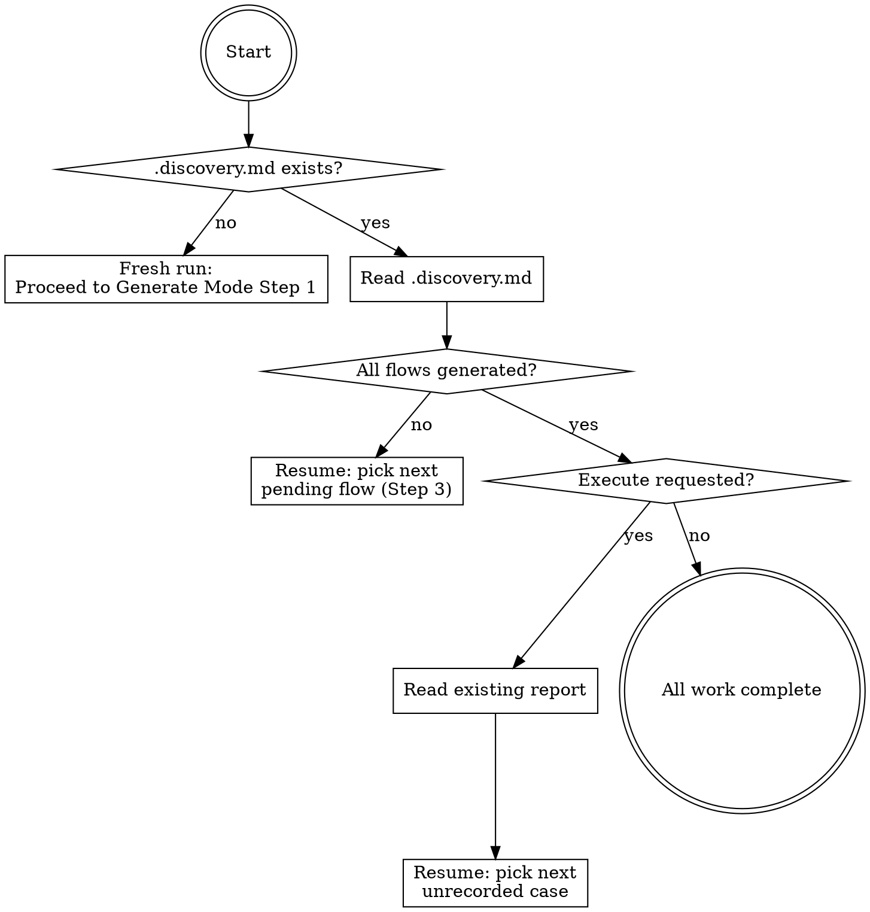

# Chunked Execution Implementation Plan

> **For Claude:** REQUIRED SUB-SKILL: Use superpowers:executing-plans to implement this plan task-by-task.

**Goal:** Make Delphi context-resilient by adding disk-persisted chunking and idempotent resume to both generate and execute modes.

**Architecture:** Modify the single skill file (`skills/delphi/skill.md`) to add a resume protocol entry point, discovery phase, flow-by-flow generation, and tier-per-flow execution. All state persists to Markdown files on disk. No hardcoded token budgets.

**Tech Stack:** Markdown (skill instructions), no runtime dependencies

---

### Task 1: Add Resume Protocol Section

**Files:**
- Modify: `skills/delphi/skill.md` (insert after Mode Detection section, ~line 50)

**Step 1: Read the current skill file**

Read `skills/delphi/skill.md` to confirm exact insertion point.

**Step 2: Insert Resume Protocol section**

Insert after the Mode Detection section (after the table ending at ~line 50), before Generate Mode (~line 105):

```markdown
## Resume Protocol

Every Delphi invocation starts here. Check disk state before doing any work.



**On fresh run:** No `.discovery.md` exists — proceed normally to Generate Mode Step 1.

**On resume (generate):** Read `.discovery.md`, find first flow with status `pending` or `in_progress`, skip to Generate Mode Step 3 for that flow.

**On resume (execute):** Read `.discovery.md` and existing report file, identify cases not yet recorded in the report, skip to Execute Mode Step 3 for the next unrecorded case.

**Key rule:** Never re-do completed work. If a flow is marked `done`, skip it. If a case has a result in the report, skip it.
```

**Step 3: Commit**

```bash
git add skills/delphi/skill.md
git commit -m "feat: add resume protocol entry point to skill"
```

---

### Task 2: Add Discovery Phase to Generate Mode

**Files:**
- Modify: `skills/delphi/skill.md` (modify Generate Mode Step 2: Surface Discovery, ~line 144-183)

**Step 1: Read the Surface Discovery section**

Read `skills/delphi/skill.md:144-183` to see exact current content.

**Step 2: Add discovery file writing to Surface Discovery**

After the existing "Present the surface map to the user" block (ends ~line 183), add:

```markdown
**Write the discovery file:**

After user confirms flows, write `tests/guided-cases/.discovery.md`:

```markdown
# Delphi Discovery

## Surfaces
- [surface-type]: [flow names] ([count] flows)
[repeat per surface type]

## Flows
| Flow | Surface | Est. Cases | Status |
|------|---------|-----------|--------|
| [flow-name] | [surface] | ~[estimate] | pending |
[one row per confirmed flow]

## Generate Progress
- Total flows: [N]
- Completed: 0
- In progress: 0
- Pending: [N]
```

**Estimation heuristic:** Each flow gets ~8-15 cases depending on surface type. UI flows average ~12 (coverage matrix has more dimensions). API flows average ~10. CLI flows average ~8.

This file is the source of truth for all subsequent work. It must be written before generating any cases.
```

**Step 3: Commit**

```bash
git add skills/delphi/skill.md
git commit -m "feat: write discovery file during surface discovery"
```

---

### Task 3: Add Flow-by-Flow Chunking to Generate Mode

**Files:**
- Modify: `skills/delphi/skill.md` (modify Generate Mode Step 3: Case Generation, ~line 186-229, and Step 5: Write Output, ~line 241-280)

**Step 1: Read Case Generation and Write Output sections**

Read `skills/delphi/skill.md:186-280`.

**Step 2: Add chunking wrapper to Case Generation (Step 3)**

Prepend to the existing Step 3 content:

```markdown
**Chunking: one flow at a time.**

For each flow listed in `.discovery.md`:

1. Check flow status — skip if `done`
2. Mark flow as `in_progress` in `.discovery.md`
3. Scan existing case files in `tests/guided-cases/[flow-name]/` — if partial cases exist from a prior run, note which coverage types are already generated
4. Generate cases for ONLY the missing coverage types using the matrix below
5. Write each case file to disk immediately after generating it (do NOT batch)
6. Update `tests/guided-cases/index.md` with new entries after each case
7. Mark flow as `done` in `.discovery.md`, update progress counts
8. Proceed to next flow

**If context is lost mid-flow:** The next invocation reads `.discovery.md`, sees the flow is `in_progress`, scans its directory for existing cases, and generates only the missing ones.
```

**Step 3: Modify Write Output (Step 5)**

Replace the current Step 5 content to emphasize incremental writes:

```markdown
### Step 5: Write Output (Incremental)

Cases are written to disk during Step 3 (not batched until the end). This step handles final bookkeeping:

1. **Verify directory structure exists:**
   ```
   tests/guided-cases/
     .discovery.md          # progress tracking
     [flow-name]/           # one directory per flow
       gc-001-description.md
     index.md               # updated incrementally during Step 3
   ```

2. **Verify `index.md` is complete** — cross-check against all case files on disk. Add any missing entries.

3. **Update `.discovery.md`** — ensure all flow statuses are accurate and progress counts match reality.

4. **Report to user** (same as before):
   > Generated X guided cases across Y flows:
   > - P0: X | P1: X | P2: X
   > [etc.]
```

**Step 4: Commit**

```bash
git add skills/delphi/skill.md
git commit -m "feat: add flow-by-flow chunking to generate mode"
```

---

### Task 4: Add Evidence Management to Execute Mode

**Files:**
- Modify: `skills/delphi/skill.md` (modify Execute Mode Step 3, ~line 325-365)

**Step 1: Read Execute Mode Step 3**

Read `skills/delphi/skill.md:325-365`.

**Step 2: Add evidence directory structure**

In Step 3b, replace the inline evidence capture instructions with external storage:

```markdown
2. **Capture evidence immediately after the action:**
   - Create evidence directory: `tests/guided-cases/evidence/gc-XXX/`
   - UI: Take screenshot, save as `tests/guided-cases/evidence/gc-XXX/step-N.png`
   - API: Save full response to `tests/guided-cases/evidence/gc-XXX/step-N-response.json`
   - CLI: Save output to `tests/guided-cases/evidence/gc-XXX/step-N-output.txt`
   - Background: Save log lines to `tests/guided-cases/evidence/gc-XXX/step-N-logs.txt`
   - **Never embed evidence content in the report** — reference by path only
```

**Step 3: Commit**

```bash
git add skills/delphi/skill.md
git commit -m "feat: add external evidence storage to execute mode"
```

---

### Task 5: Add Tier-per-Flow Chunking to Execute Mode

**Files:**
- Modify: `skills/delphi/skill.md` (modify Execute Mode Steps 1, 3, and 4, ~line 286-420)

**Step 1: Read full Execute Mode section**

Read `skills/delphi/skill.md:282-421`.

**Step 2: Add chunking to Step 1 (Load Cases)**

After the existing filter table, add:

```markdown
5. **Check for prior progress:**
   - Read `.discovery.md` Execute Progress section
   - Read existing report file (if any) in `tests/guided-cases/reports/`
   - Build list of already-completed case IDs from the report
   - Filter them out of the execution list — only execute cases not yet recorded
   - If all cases already have results, report "All cases already executed" and stop
```

**Step 3: Add chunking to Step 3 (Execute Cases)**

Prepend to existing Step 3:

```markdown
**Chunking: one priority tier per flow at a time.**

Execution order: P0 cases across all flows, then P1, then P2.

Within each tier, work one flow at a time:
1. Select all cases for current priority tier + current flow
2. Execute them (steps 3a-3c below)
3. After each case: append result to report file immediately
4. Update `.discovery.md` execute progress counts
5. Move to next flow in this tier, then next tier

**If context is lost mid-tier:** Next invocation reads the report, identifies which cases have results, and picks up from the next unrecorded case.
```

**Step 4: Modify Step 4 (Report) for incremental writing**

Replace the report generation approach:

```markdown
### Step 4: Report (Incremental)

The report file is written incrementally during Step 3 — one entry per case as it completes. This step handles finalization:

1. **Report file location:** `tests/guided-cases/reports/YYYY-MM-DD-HH-MM-report.md`
2. **On first case:** Create the report file with the header (run metadata, filter info)
3. **After each case:** Append the case result (pass/fail/skip + evidence paths)
4. **On completion (or resume completion):** Add the summary section (totals, percentages)
5. **Evidence references:** Always use relative paths (`evidence/gc-XXX/step-N.png`), never inline content

[Keep existing report template format — just change WHEN it's written from "all at end" to "incrementally"]
```

**Step 5: Commit**

```bash
git add skills/delphi/skill.md
git commit -m "feat: add tier-per-flow chunking to execute mode"
```

---

### Task 6: Update .discovery.md Execute Progress Tracking

**Files:**
- Modify: `skills/delphi/skill.md` (add execute progress tracking to discovery file format)

**Step 1: Read discovery file section**

Read the discovery file section added in Task 2.

**Step 2: Add execute progress tracking**

Extend the `.discovery.md` template to include execution state:

```markdown
## Execute Progress
- Filter: [active filter, e.g., "P0" or "all"]
- Current tier: [P0 | P1 | P2]
- Current flow: [flow-name]
- Total cases matching filter: [N]
- Passed: [N]
- Failed: [N]
- Skipped: [N]
- Pending: [N]
- Report: [relative path to current report file]
```

**Step 3: Commit**

```bash
git add skills/delphi/skill.md
git commit -m "feat: add execute progress tracking to discovery file"
```

---

### Task 7: Integration Test — Verify Full Skill File Coherence

**Files:**
- Read: `skills/delphi/skill.md` (full file, verify all sections flow correctly)

**Step 1: Read the complete skill file**

Read the entire `skills/delphi/skill.md` after all previous edits.

**Step 2: Verify section order and coherence**

Check that sections appear in this order:
1. Frontmatter + Overview
2. Mode Detection
3. Resume Protocol (NEW)
4. Guided Case Format
5. Generate Mode (with discovery + chunking)
6. Execute Mode (with chunking + evidence management)

**Step 3: Verify no contradictions**

Check for:
- References to old behavior that contradicts new chunking (e.g., "write all cases at the end")
- Missing cross-references between Resume Protocol and the two modes
- Discovery file format consistency between where it's created and where it's read

**Step 4: Fix any issues found**

Edit as needed.

**Step 5: Commit final cleanup**

```bash
git add skills/delphi/skill.md
git commit -m "refactor: ensure skill file coherence after chunking additions"
```

---

### Task 8: Update Design Doc Status

**Files:**
- Modify: `docs/plans/2026-02-27-chunked-execution-design.md`

**Step 1: Update status from Draft to Implemented**

Change the status line from `Draft` to `Implemented`.

**Step 2: Commit**

```bash
git add docs/plans/2026-02-27-chunked-execution-design.md
git commit -m "docs: mark chunked execution design as implemented"
```
