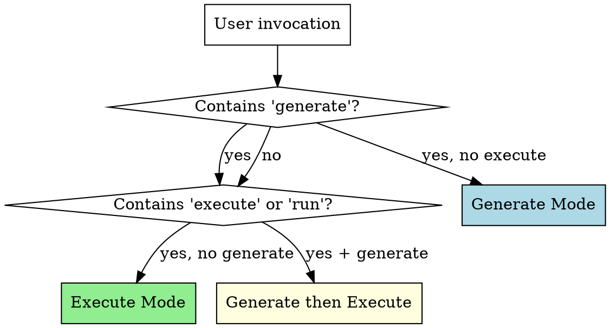
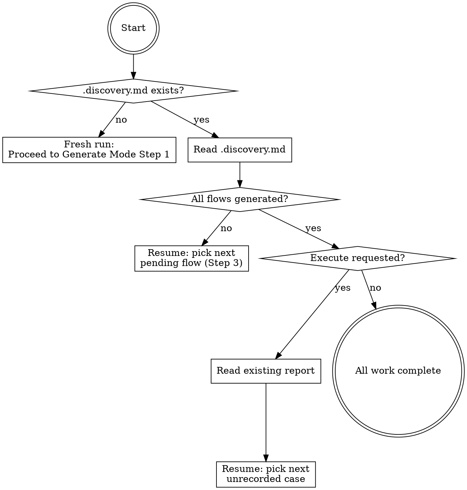

# Delphi

*The Oracle that foresees all outcomes.*

## Overview

Delphi generates comprehensive test scenarios — **guided cases** — for any software. It analyzes code, docs, specs, and running apps to produce structured Markdown test cases covering positive, negative, edge, accessibility, and security paths. Cases serve two audiences: human testers who walk through them step-by-step, and AI agents who execute them automatically.

**Core principle:** Exhaustive by default. Generate ALL scenarios. Users scope down, never up.

**Two modes:**
- **Generate** — analyze project context, discover testable surfaces, produce guided cases
- **Execute** — read generated cases, run them via browser automation or programmatic verification

## Mode Detection



| Invocation Pattern | Mode |
|-------------------|------|
| "Generate guided cases for X" | Generate |
| "Write test scenarios for X" | Generate |
| "Execute guided cases" / "Run guided cases" | Execute |
| "Test the guided cases" | Execute |
| "Generate and execute guided cases" | Generate, then Execute |
| Pipeline trigger (post-build) | Generate (+ Execute if browser available) |
| No guided cases exist yet + user says "test this" | Generate first, ask about Execute |

**Default behavior:** If guided cases don't exist yet, always Generate first. If they exist and user says "test" or "run", Execute.

## Model Selection

Delphi uses different models per phase to balance reasoning quality with cost:

| Phase | Default Model | Override Example |
|-------|--------------|------------------|
| Generate | opus | "generate with sonnet" |
| Execute (orchestrator) | inherits session model | — |
| Execute (subagents) | sonnet | "execute with opus" |

- Generate runs once and needs deep analytical reasoning for thorough edge case discovery
- Execute subagents are the cost multiplier — procedural step-following at high volume
- User override: any explicit model instruction (e.g., "use haiku for subagents") takes precedence

When dispatching subagents via the Agent tool, pass the `model` parameter with the selected model.

## Resume Protocol

Every Delphi invocation starts here. Check disk state before doing any work.



**On fresh run:** No `.discovery.md` exists — proceed normally to Generate Mode Step 1.

**On resume (generate):** Read `.discovery.md`, collect all flows with status `pending` or `in_progress`, skip to Generate Mode Step 3 which will dispatch them (in parallel if possible, or sequentially).

**On resume (execute):** Read `.discovery.md` and existing report file. Also scan for any `.report-fragment.md` files in flow directories — these indicate partial parallel execution. Merge fragment results with the main report to build the complete list of already-completed cases. Skip to Execute Mode Step 2 (to re-classify remaining flows) then Step 3 for unrecorded cases only.

**Key rule:** Never re-do completed work. If a flow is marked `done`, skip it. If a case has a result in the report, skip it.

## Guided Case Format

Every guided case MUST follow this exact template:

~~~markdown
# GC-XXX: [Descriptive Scenario Title]

## Metadata
- **Type**: positive | negative | edge | accessibility | performance | security
- **Priority**: P0 | P1 | P2
- **Surface**: ui | api | cli | background
- **Flow**: [logical flow name, e.g., "authentication", "checkout"]
- **Tags**: [comma-separated searchable tags]
- **Generated**: YYYY-MM-DD
- **Last Executed**: YYYY-MM-DD | never

## Preconditions

### Environment
Bullet list of what must be true about the runtime environment. These CANNOT be created by the agent.
Examples: app running at URL, API endpoint reachable, CLI tool installed, external service accessible, user has required role/permissions.

### Data
Bullet list of data that must exist. Each tagged with source and optional setup instruction.
Sources: `local-db` | `external/<service>` | `inline`
- `local-db` — agent can attempt to create via API/UI using the setup instruction
- `external/<service>` — developer must provide, or case skips
- `inline` — value is crafted directly in the step, no external dependency

Example:
- User account exists (source: local-db, setup: POST /api/users with test data)
- Stripe customer exists (source: external/stripe, setup: dev-provided)
- Negative amount value (source: inline)

## Steps

Numbered steps. Each step has:
1. [Action description — what to do]
   - **Target**: [where — URL, element description, endpoint, command]
   - **Input** (if applicable): [what data to provide]
   - **Expected**: [what should happen — one or more expected outcomes]

## Success Criteria
- [ ] [Condition that must be true for this case to pass]

## Failure Criteria
- [Any ONE of these being true means the case failed]

## Notes
Optional. Known issues, environment requirements, things to watch for.
~~~

**Case ID convention:** `GC-XXX` — zero-padded sequential number, unique across the project.

**File naming:** `gc-XXX-short-description.md` — lowercase, hyphens, in a flow-specific subdirectory.

**Directory structure:**
```
tests/guided-cases/
  .discovery.md              # progress tracking (created during surface discovery)
  index.md                   # case index (updated incrementally)
  [flow-name]/               # one directory per flow
    gc-001-description.md
    gc-002-description.md
  evidence/                  # execution evidence (created during execute mode)
    gc-001/
      step-1.png
  reports/                   # execution reports
    YYYY-MM-DD-HH-MM-report.md
```

---

## Generate Mode

Follow these steps in order. Do NOT skip steps. Do NOT start writing cases before completing surface discovery.

**Note:** If the Resume Protocol detected a prior run, skip directly to Step 3 for the next pending flow. Steps 1-2 are only needed on fresh runs.

### Step 1: Context Gathering

Collect all available project context. Use these exact searches:

**Code structure:**
- Routes/pages: Glob for `**/pages/**`, `**/routes/**`, `**/app/**/page.*`, `**/app/**/layout.*`, `**/*router*`
- Components: Glob for `**/components/**/*.{tsx,jsx,vue,svelte,html}`
- API handlers: Glob for `**/api/**/*.{ts,js,py,go,rs}`, `**/controllers/**`, `**/handlers/**`, `**/routes/**/*.{ts,js}`
- CLI entry points: Glob for `**/bin/**`, `**/cli/**`, `**/commands/**`, `**/*cli*.*`
- Models/schemas: Glob for `**/models/**`, `**/schemas/**`, `**/types/**`, `**/entities/**`
- Config: Glob for `**/.env*`, `**/config/**`, `**/next.config*`, `**/vite.config*`, `**/tsconfig*`

**Documentation:**
- Read if they exist: `README.md`, `CLAUDE.md`, `docs/**/*.md`, `*.md` in project root
- API docs: `openapi.yaml`, `openapi.json`, `swagger.yaml`, `swagger.json`
- Design docs: `docs/plans/**/*.md`

**Recent changes:**
- Run: `git log --oneline -20` to see what was recently built
- Run: `git diff --stat HEAD~5` to see what files changed recently

**Existing test coverage:**
- Glob for `**/*.test.*`, `**/*.spec.*`, `**/tests/**`, `**/__tests__/**`, `**/test/**`
- Read a few test files to understand what's already covered

**Running app detection (if applicable):**
- Check common ports: `curl -s -o /dev/null -w "%{http_code}" http://localhost:3000` (also try 3001, 5173, 8080, 8000, 4200)
- If Chrome MCP tools are available AND app is running, navigate to it and take a screenshot for visual context

**User-provided context:**
- If the user specified a scope (e.g., "generate cases for auth"), focus context gathering on that area
- If the user provided docs or specs, read those first

After gathering, mentally summarize: what surfaces exist, what flows they form, and what's already tested.

### Step 2: Surface Discovery

From gathered context, build a surface map.

**Enumerate every testable surface:**

| Surface Type | How to Find | Example |
|-------------|-------------|---------|
| UI pages | Routes, page files, navigation components | `/login`, `/dashboard`, `/settings` |
| API endpoints | Route handlers, controller files, OpenAPI spec | `POST /api/auth/login`, `GET /api/users` |
| CLI commands | bin/ files, command handlers, --help output | `myapp init`, `myapp deploy --env prod` |
| Background jobs | Queue workers, cron configs, webhook handlers | `processPayments`, `sendEmailDigest` |

**Group surfaces into flows:**

A flow is a logical user journey that spans one or more surfaces. Examples:
- **authentication**: login page (UI) + `/api/auth/login` (API) + session management (background)
- **user-management**: settings page (UI) + `/api/users` (API) + profile update
- **checkout**: cart page → payment page → confirmation page (UI) + payment API + order processing (background)

Each surface can belong to multiple flows.

**Present the surface map to the user:**

After discovery, show the user what you found:

> **Surface Map:**
>
> **authentication** (3 surfaces)
> - UI: `/login`, `/register`, `/forgot-password`
> - API: `POST /api/auth/login`, `POST /api/auth/register`, `POST /api/auth/reset`
>
> **dashboard** (2 surfaces)
> - UI: `/dashboard`
> - API: `GET /api/stats`, `GET /api/recent-activity`
>
> [etc.]
>
> Should I generate guided cases for all flows, or focus on specific ones?

**Wait for user confirmation before proceeding to Step 3.** The user may want to scope down to specific flows.

**Write the discovery file:**

After user confirms flows, write `tests/guided-cases/.discovery.md`:

~~~markdown
# Delphi Discovery

## Surfaces
- [surface-type]: [flow names] ([count] flows)
[repeat per surface type]

## Flows
| Flow | Surface | Est. Cases | Status |
|------|---------|-----------|--------|
| [flow-name] | [surface] | ~[estimate] | pending |
[one row per confirmed flow]

## Generate Progress
- Total flows: [N]
- Completed: 0
- In progress: 0
- Pending: [N]

## Execute Progress
- Filter: [active filter, e.g., "P0" or "all"]
- Current tier: [P0 | P1 | P2]
- Current flow: [flow-name or "not started"]
- Total cases matching filter: [N]
- Passed: 0
- Failed: 0
- Skipped: 0
- Pending: [N]
- Report: [relative path to current report file, or "none"]
~~~

**Estimation heuristic:** Each flow gets ~8-15 cases depending on surface type. UI flows average ~12 (coverage matrix has more dimensions). API flows average ~10. CLI flows average ~8.

This file is the source of truth for all subsequent work. It MUST be written before generating any cases.

### Step 3: Case Generation

**Chunking: one flow at a time. Parallel when possible.**

Collect all pending flows from `.discovery.md` (status `pending` or `in_progress`).

**Parallel dispatch (preferred — use when the Task tool is available):**

Before dispatching, mark all pending flows as `in_progress` in `.discovery.md`. This signals that parallel work was attempted — if context is lost, a resume will scan disk for partial results.

Dispatch one subagent per pending flow using the Agent tool with `model: "opus"` (or user-specified override). Each subagent:
1. Receives: flow name, surface type, the coverage matrix (copy the relevant matrix below into the prompt), the guided case template, and the project's `tests/guided-cases/` path
2. Scans existing case files in `tests/guided-cases/[flow-name]/` — skips already-generated coverage types
3. Generates all missing cases for its flow using the matrix
4. Writes each case file to disk immediately (use temporary IDs like `gc-FLOW-001`, final IDs assigned by main agent)
5. Writes its flow's entries to a temporary index fragment: `tests/guided-cases/[flow-name]/.index-fragment.md`
6. **MUST NOT write to `index.md` or `.discovery.md`** — these are owned by the main agent to avoid file conflicts

After all subagents complete:
1. Merge all `.index-fragment.md` files into `tests/guided-cases/index.md`
2. Clean up fragment files
3. Update `.discovery.md` — mark all completed flows as `done`, update progress counts
4. Assign case IDs sequentially across all flows (renaming files if needed to ensure unique GC-XXX IDs)

**Important for subagent prompts:** Include the COMPLETE coverage matrix, case template, and generation rules in each subagent's prompt. Subagents do NOT have access to the skill file — they need everything inline.

**Sequential fallback (when Task tool is unavailable or only 1-2 flows):**

For each flow listed in `.discovery.md`:
1. Check flow status — skip if `done`
2. Mark flow as `in_progress` in `.discovery.md`
3. Scan existing case files in `tests/guided-cases/[flow-name]/` — if partial cases exist from a prior run, note which coverage types are already generated
4. Generate cases for ONLY the missing coverage types using the matrix below
5. Write each case file to disk immediately after generating it (do NOT batch)
6. Update `tests/guided-cases/index.md` with new entries after each case
7. Mark flow as `done` in `.discovery.md`, update progress counts
8. Proceed to next flow

**If context is lost mid-flow:** The next invocation reads `.discovery.md`, sees the flow is `in_progress`, scans its directory for existing cases, and generates only the missing ones.

**Data strategy for coverage:** Boundary, validation, negative, and security cases should use inline crafted test values rather than assuming environment data exists. Only happy-path and integration cases should depend on real environment data. Tag data preconditions accordingly.

For each flow, generate guided cases using this coverage matrix:

| Dimension | What to Generate | Default Priority |
|-----------|-----------------|-----------------|
| **Happy path** | One end-to-end successful flow | P0 |
| **Input validation** | One case per validation rule per input field (empty, too long, wrong format, special chars) | P1 |
| **Boundary values** | Empty state, single item, min value, max value, just-over-max | P1 |
| **Auth/permissions** | Authorized access for each role + unauthorized denial for each role | P0 |
| **Error states** | Network failure, server 500, timeout, 404 not found, malformed response | P0 |
| **State transitions** | Back button mid-flow, refresh mid-flow, navigate away and return, stale data | P1 |
| **Empty/first-use states** | No data yet, first-time user, cleared/deleted data | P1 |
| **Accessibility** | Keyboard-only navigation, tab order, focus management, screen reader labels | P2 |
| **Concurrency** | Double-click submit, duplicate form submission, race conditions | P1 |
| **Security** | XSS in text inputs, SQL injection in search, CSRF, auth bypass, session fixation | P0 |

**For API surfaces, also add:**

| Dimension | What to Generate | Default Priority |
|-----------|-----------------|-----------------|
| **Valid request** | Correct payload, correct headers, expected response | P0 |
| **Missing required fields** | Omit each required field one at a time | P1 |
| **Invalid types** | String where number expected, null where required, array where object expected | P1 |
| **Oversized payloads** | Very long strings, very large numbers, deeply nested objects | P2 |
| **Auth variations** | No token, expired token, wrong role token, valid token | P0 |

**For CLI surfaces, also add:**

| Dimension | What to Generate | Default Priority |
|-----------|-----------------|-----------------|
| **Valid usage** | Correct command with expected flags | P0 |
| **Missing required args** | Omit each required argument | P1 |
| **Invalid flags** | Unknown flags, wrong flag types, conflicting flags | P1 |
| **Help text** | `--help` outputs accurate, complete documentation | P1 |

**Generation rules:**
1. Use the EXACT guided case template from the "Guided Case Format" section above
2. Every case gets a unique `GC-XXX` ID, sequential across the project
3. Be SPECIFIC in steps — name exact URLs, exact button text, exact field names, exact API endpoints, exact commands
4. Include specific test values in steps — NEVER use placeholders like "enter a value":
   - **Happy path**: Use realistic values (e.g., "John Doe", "john@example.com", "$49.99")
   - **Boundary/edge**: Generate crafted values inline (e.g., `-1`, `0`, `999999999`, empty string `""`)
   - **Validation**: Include invalid inputs that test error handling (e.g., `<script>alert(1)</script>`, SQL injection strings, strings exceeding max length)
   - **Negative cases**: Include values that SHOULD be rejected — the expected outcome is an error message or validation failure
   - Crafted test values require no external data — tag these data preconditions as `source: inline`
5. Each case tests ONE scenario — don't combine multiple scenarios in one case
6. Write expected outcomes that are observable and verifiable (not vague like "page works correctly")

### Step 4: Priority Assignment

Review generated cases and assign priorities:

- **P0 (Critical)**: Must work or the software is broken. Happy paths, authentication, security, critical error handling. If this fails, users can't use the core functionality or data is at risk.
- **P1 (Important)**: Should work for a good user experience. Validation, boundary values, state transitions, concurrency. If this fails, users hit rough edges but core functionality works.
- **P2 (Nice-to-have)**: Ideal to work. Accessibility, cosmetic issues, rare edge cases, oversized payloads. If this fails, some users are affected in specific situations.

The coverage matrix above provides default priorities. Override when the specific context warrants it (e.g., if the app is a banking app, all security cases are P0).

### Step 5: Write Output (Incremental)

Cases are written to disk during Step 3 (not batched until the end). This step handles final bookkeeping after all flows are complete.

1. **If parallel dispatch was used:** Merge index fragments.
   - Read each `tests/guided-cases/[flow-name]/.index-fragment.md`
   - Assign sequential GC-XXX IDs across all flows (subagents use temporary IDs)
   - Rename case files to match final GC-XXX IDs (e.g., `gc-auth-001.md` → `gc-001-login-happy-path.md`)
   - Update file paths in index entries to match renamed files
   - Merge all entries into `tests/guided-cases/index.md`
   - Delete `.index-fragment.md` files

2. **Verify directory structure exists:**
   ```
   tests/guided-cases/
     .discovery.md          # progress tracking
     [flow-name]/           # one directory per flow (lowercase, hyphenated)
       gc-001-description.md
       gc-002-description.md
     index.md               # updated incrementally during Step 3
   ```

3. **Verify `index.md` is complete** — cross-check against all case files on disk. Add any missing entries. The index uses this structure:

~~~markdown
# Guided Cases Index

Generated by Delphi on YYYY-MM-DD

| ID | Title | Type | Priority | Surface | Flow | Status |
|----|-------|------|----------|---------|------|--------|
| [GC-001](flow/gc-001-description.md) | Scenario title | positive | P0 | ui | auth | pending |
| [GC-002](flow/gc-002-description.md) | Scenario title | negative | P0 | ui | auth | pending |

## Summary
- **Total**: X cases
- **By Priority**: P0: X | P1: X | P2: X
- **By Type**: Positive: X | Negative: X | Edge: X | Accessibility: X | Security: X
- **By Surface**: UI: X | API: X | CLI: X | Background: X
~~~

4. **Update `.discovery.md`** — ensure all flow statuses are accurate and progress counts match reality.

5. **Report to user:**

> Generated X guided cases across Y flows:
> - P0: X | P1: X | P2: X
> - Positive: X | Negative: X | Edge: X | Security: X
>
> Cases saved to `tests/guided-cases/`. Review them, then say "execute guided cases" to run them.

---

## Execute Mode

**Note:** If the Resume Protocol detected prior execution progress, skip to Step 3 with only the unrecorded cases. Steps 1-2 are only fully needed on fresh execution runs.

### Step 1: Load Cases

1. Read `tests/guided-cases/index.md` to get the full case list
2. Apply user filters if specified:

| Filter | Example | What it does |
|--------|---------|-------------|
| By priority | "Execute P0 cases" | Only cases with Priority P0 |
| By type | "Execute negative cases" | Only cases with Type negative |
| By surface | "Execute UI cases" | Only cases with Surface ui |
| By flow | "Execute auth cases" | Only cases in the auth flow |
| By ID range | "Execute GC-001 to GC-010" | Specific case range |
| All | "Execute all guided cases" | Every case |

3. If no filter specified, default to P0 cases only (safest starting point)
4. Read each selected case file and parse: metadata, preconditions, steps, success/failure criteria
5. **Check for prior progress:**
   - Read `.discovery.md` Execute Progress section
   - Read existing report file (if any) in `tests/guided-cases/reports/`
   - Build list of already-completed case IDs from the report
   - Filter them out of the execution list — only execute cases not yet recorded
   - If all cases already have results, report "All cases already executed" and stop

### Step 2: Choose Execution Strategy

Route each case to the right execution method based on its Surface metadata:

| Surface | Execution Method | Tools |
|---------|-----------------|-------|
| `ui` | Browser automation | Chrome MCP: `navigate`, `find`, `computer` (click, type, screenshot), `read_page`, `get_page_text` |
| `api` | HTTP requests | Bash: `curl -s -X METHOD URL -H "header" -d 'body'` |
| `cli` | Shell commands | Bash: direct command execution, capture stdout + stderr + exit code |
| `background` | Inspection | Bash: log tailing (`tail`), database queries, process checks (`ps`, `curl` health endpoints) |

**Capability check before starting:**
- If Surface is `ui` and Chrome MCP tools are NOT available: mark case as **skipped** with reason "No browser access"
- If Surface is `api` and the app is not running: mark case as **skipped** with reason "App not running"
- If Surface is `cli` and the command is not installed: mark case as **skipped** with reason "Command not found"

**Classify flows for parallel vs. sequential execution:**

Scan all non-skipped cases and bucket their flows:

| Bucket | Criteria | Execution |
|--------|----------|-----------|
| **Parallel** | Flow has ZERO `ui` surface cases in the execution list | One subagent per flow, all dispatched concurrently |
| **Sequential** | Flow has ANY `ui` surface case in the execution list | Run one flow at a time on the shared browser |

Mixed flows (both UI and non-UI cases) go to the **sequential** bucket — do not split a flow across strategies.

Tell the user:
- How many cases will be executed and how many skipped
- How many flows will run in parallel vs. sequentially
- Which flows are in each bucket

### Step 3: Execute Cases

**Parallel dispatch for non-UI flows, sequential for UI flows.**

Collect all flows from the classification in Step 2.

**Parallel dispatch (preferred — use when the Agent tool is available):**

Before dispatching, update `.discovery.md` execute progress to mark parallel flows as `in_progress`.

Dispatch one subagent per parallel flow using the Agent tool with `model: "sonnet"` (or user-specified override). Each subagent receives:
1. Flow name and all case files for that flow (full markdown content — subagents cannot read the skill file)
2. The execution instructions for steps 3a-3c below (copy them into the subagent prompt)
3. The surface-to-tool mapping table from Step 2
4. Evidence output path: `tests/guided-cases/evidence/`
5. Fragment output path: `tests/guided-cases/[flow-name]/.report-fragment.md`

Each subagent:
1. Executes all cases for its flow in priority order (P0 → P1 → P2) using steps 3a-3c
2. Writes evidence files to `tests/guided-cases/evidence/gc-XXX/`
3. Writes a `.report-fragment.md` in the flow directory with per-case results
4. **MUST NOT write to the main report file, `.discovery.md`, or `index.md`** — these are owned by the main agent

**Important for subagent prompts:** Include the COMPLETE execution instructions (steps 3a-3c), surface-to-tool mapping, and evidence capture rules in each subagent's prompt. Subagents do NOT have access to the skill file — they need everything inline.

**Sequential execution for UI flows (runs concurrently with parallel dispatch):**

While parallel subagents are running, the main agent executes UI flows one at a time on the shared browser:
1. Select next UI flow
2. Execute all cases in priority order (P0 → P1 → P2) using steps 3a-3c
3. Write `.report-fragment.md` in the flow directory
4. Write evidence to `tests/guided-cases/evidence/gc-XXX/`
5. Move to next UI flow

**Sequential fallback (when Agent tool is unavailable or only 1-2 total flows):**

Execute all flows sequentially, one flow at a time, all cases in priority order. Write results directly to the report file (no fragments needed). This is the pre-parallel behavior.

**If context is lost mid-execution:** Next invocation reads the report + any `.report-fragment.md` files, identifies which cases have results, and picks up from the next unrecorded case. Partial fragments from crashed subagents are preserved.

For each case (used by both subagents and main agent), in order:

**3a. Verify Preconditions**

**Environment preconditions (check first):**
- Check each environment precondition (app running, API reachable, CLI installed, etc.)
- If ANY environment precondition is not met → skip case with reason
- Do NOT attempt to create environment prerequisites

**Data preconditions (check second, only if environment passed):**
- For each data precondition, check the source tag:
  - `local-db`: attempt setup using the provided setup instruction. If setup fails → skip with reason.
  - `external/<service>`: check if data exists. If not → skip with reason "requires \<service\> test data".
  - `inline`: no check needed — the test value is crafted directly in the step itself.

**3b. Execute Each Step**

For each numbered step in the case:

1. **Perform the action** described in the step:
   - UI: Use Chrome MCP tools — `navigate` for URLs, `find` to locate elements, `computer` for click/type, `form_input` for form fields
   - API: Use `curl` via Bash with exact endpoint, method, headers, body from the step
   - CLI: Run the command via Bash
   - Background: Check logs, query database, inspect process state

2. **Capture evidence immediately after the action:**
   - Create evidence directory: `tests/guided-cases/evidence/gc-XXX/`
   - UI: Take screenshot, save as `tests/guided-cases/evidence/gc-XXX/step-N.png`
   - API: Save full response to `tests/guided-cases/evidence/gc-XXX/step-N-response.json`
   - CLI: Save output to `tests/guided-cases/evidence/gc-XXX/step-N-output.txt`
   - Background: Save log lines to `tests/guided-cases/evidence/gc-XXX/step-N-logs.txt`
   - **Never embed evidence content in the report** — reference by path only

3. **Verify expected outcomes:**
   - Compare actual result against EACH "Expected" item in the step
   - For UI: Use `read_page`, `find`, `get_page_text`, or screenshot inspection to verify visible state
   - For API: Check status code, response body fields, headers
   - For CLI: Check output text, exit code
   - Record: PASS if all expected outcomes match, FAIL if any do not

4. **On step failure:**
   - Record which expected outcome failed
   - Record actual vs. expected
   - Capture evidence of the failure
   - **Stop executing this case** — mark it as FAILED at this step
   - **Continue to the next case** (do NOT abort the entire run)

**3c. On Case Completion**
- If all steps passed: mark case as **passed**
- Check success criteria — all must be true
- Check failure criteria — none must be true
- Final determination: PASS or FAIL

### Step 4: Report (Merge + Finalize)

**If parallel dispatch was used:** Merge fragments before writing the final report.

1. Wait for all subagents to complete
2. Read all `.report-fragment.md` files from `tests/guided-cases/[flow-name]/`
3. Combine with results from sequentially-executed UI flows
4. Write the merged report to `tests/guided-cases/reports/YYYY-MM-DD-HH-MM-report.md`
5. Compute aggregate stats (passed/failed/skipped counts + percentages)
6. Clean up `.report-fragment.md` files

**If sequential fallback was used:** The report was written incrementally during Step 3. Just add the summary section.

**Report fragment format** (written by each subagent):

~~~markdown
## [Flow Name] Results

| ID | Title | Result | Failed Step | Evidence |
|----|-------|--------|-------------|----------|
| GC-XXX | Title | passed/failed/skipped | N/A or step N | `evidence/gc-XXX/` |
~~~

**Final report file:** `tests/guided-cases/reports/YYYY-MM-DD-HH-MM-report.md`

Report format:

~~~markdown
# Delphi Execution Report

**Run**: YYYY-MM-DD HH:MM
**Cases Executed**: X of Y total
**Filters**: [filters applied, or "none"]
**Execution**: [parallel (N flows) + sequential (M UI flows) | sequential only]

## Results
- **Passed**: X (XX%)
- **Failed**: X (XX%)
- **Skipped**: X (XX%)

## Failures

### GC-XXX: [Case Title]
- **Failed at Step**: N
- **Expected**: [what should have happened]
- **Actual**: [what actually happened]
- **Evidence**: [path to evidence file, e.g., `evidence/gc-XXX/step-N.png`]
- **Severity**: [P0/P1/P2 from case metadata]

[repeat for each failed case]

## Skipped

| ID | Title | Reason |
|----|-------|--------|
| GC-XXX | Title | No browser access |

## Passed

<details>
<summary>X cases passed (click to expand)</summary>

| ID | Title |
|----|-------|
| GC-001 | Login happy path |
| GC-004 | Dashboard loads |

</details>
~~~

**After writing the report:**

1. Update `tests/guided-cases/index.md` — set each executed case's Status column to `passed`, `failed`, or `skipped`, and update the Last Executed date in each case's metadata
2. Update `.discovery.md` execute progress counts
3. Report summary to user:

> **Delphi Execution Report**
> - Passed: X | Failed: X | Skipped: X
> - Execution: [N flows parallel + M UI flows sequential | sequential only]
> - Report saved to `tests/guided-cases/reports/YYYY-MM-DD-HH-MM-report.md`
> - [If failures] X failures need attention — check the report for details.
